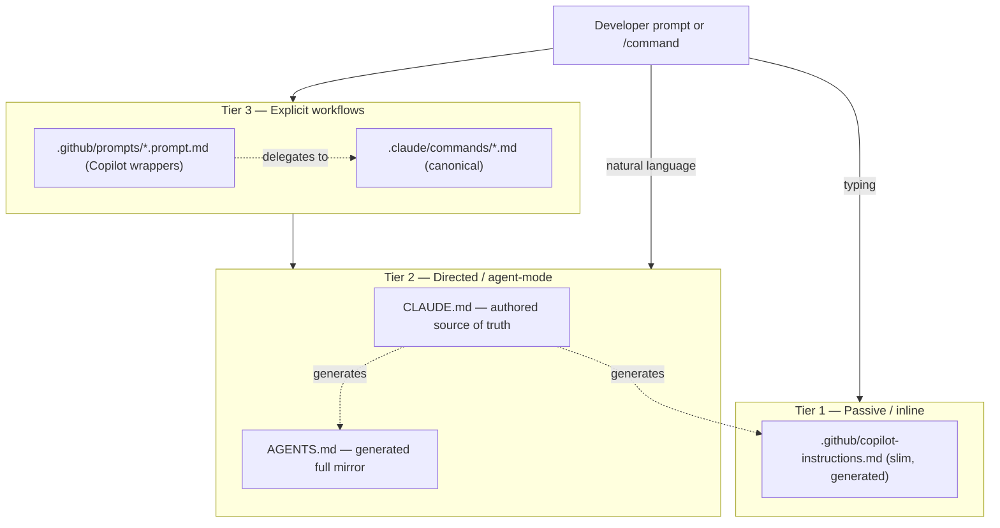
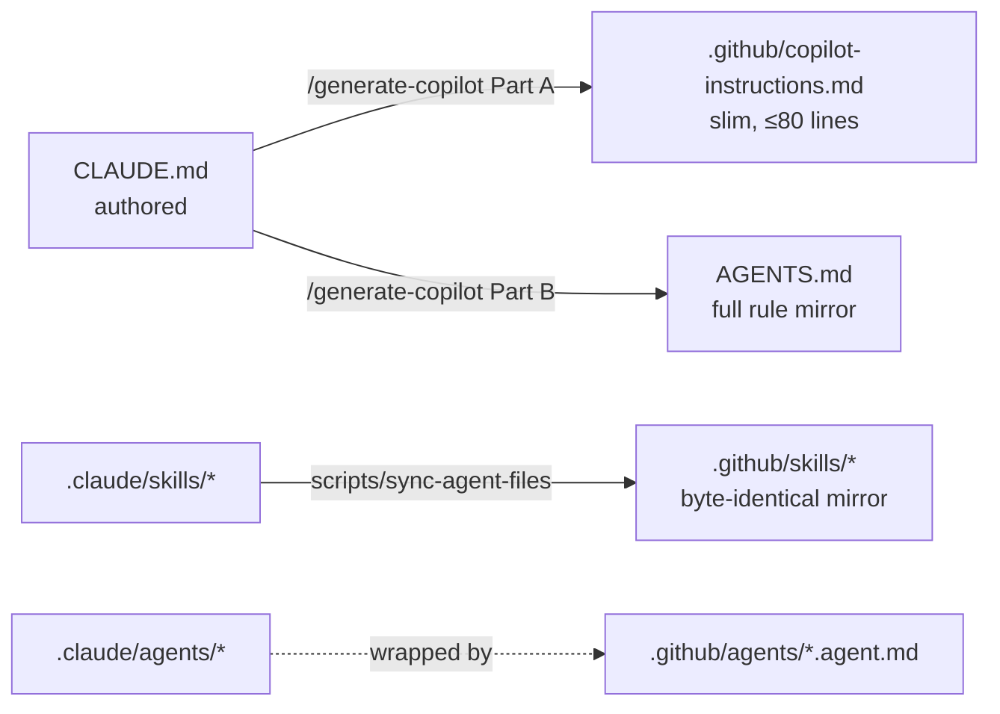
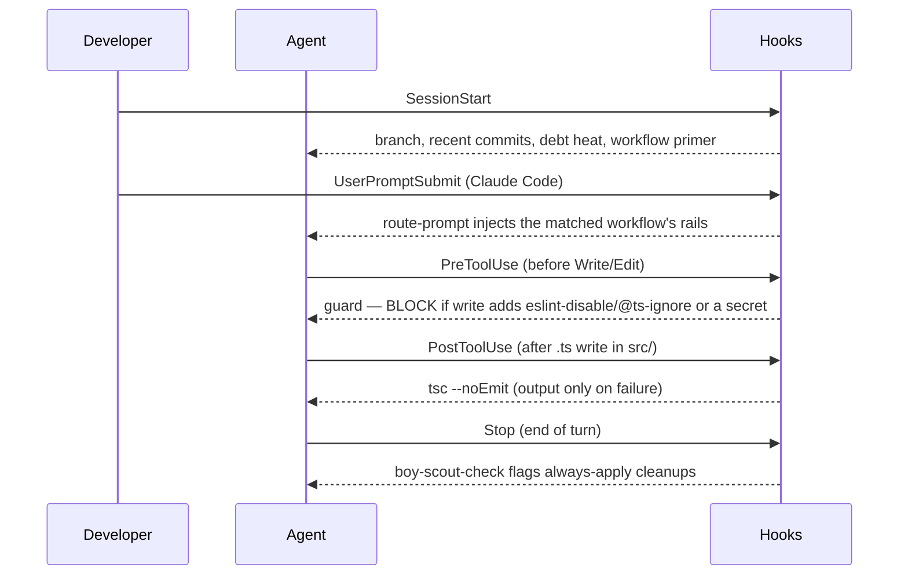

# AI Tech Lead Framework (Angular) — Architecture

> **Audience.** This is the canonical, human-readable map of what this repo does and how the pieces fit. A senior reviewer should start here, then use [REVIEW-GUIDE.md](./REVIEW-GUIDE.md).
> **AI agents do not read this file** — they read `README.md` → `CLAUDE.md` / `AGENTS.md` and run the workflow commands. This doc and its generated `architecture.html` are for people.
> **Generated view.** `docs/architecture.html` is generated from this file by `scripts/build-architecture-html.sh` (renders the Mermaid diagrams). Edit *this* file; never hand-edit the HTML.

---

## 1. What it is

A template that turns Claude Code and GitHub Copilot into a "tech lead" for an Angular (17+) codebase: it gives every AI tool the team's actual conventions, architecture, and debt priorities from one source of truth, and enforces a consistent execution model (plan → verified subtasks → Boy Scout → self-review) across tools and developers. Quality improves as a side effect of normal work (Trojan Horse), and an explicit Leanness doctrine plus a `bloat-radar` counterweight stop AI from over-abstracting.

It is installed into a target repo (see README "Quick Start" / `scripts/install.sh`), then `/bootstrap` (greenfield) or `/adopt` (existing AI setup) populates it from the real codebase.

---

## 2. Three-tier model



- **Tier 1 — Passive**: `.github/copilot-instructions.md` (≤80 lines, generated) drives Copilot inline completions.
- **Tier 2 — Directed**: `CLAUDE.md` (authored, canonical) is read by Claude Code; `AGENTS.md` (generated full mirror) is read by Copilot agent-mode/CLI, Codex, Cursor, Gemini, Aider.
- **Tier 3 — Explicit**: `/feature`, `/fix`, … live canonically in `.claude/commands/`; `.github/prompts/*.prompt.md` are thin wrappers that delegate to them (single source per workflow).

---

## 3. Source of truth → generated artifacts

`CLAUDE.md` is the only file authored by hand. Everything below is generated from it and **drift-checked in CI** — the same discipline applied throughout.



| File | Authored or generated | Consumed by |
|------|----------------------|-------------|
| `CLAUDE.md` | **Authored** (canonical) | Claude Code |
| `AGENTS.md` | Generated mirror | Copilot agent/CLI, Codex, Cursor, Gemini, Aider |
| `.github/copilot-instructions.md` | Generated (slim) | Copilot inline completions |
| `.github/skills/` | Generated mirror of `.claude/skills/` | Copilot CLI / cloud agent |
| `.github/agents/*.agent.md` | Wrappers over `.claude/agents/` | Copilot custom agents |
| `docs/architecture.html` | Generated from this file | Humans |

---

## 4. Workflow commands (Tier 3)

Same names in Claude Code (`.claude/commands/`) and Copilot Chat (`.github/prompts/`).

| Command | Purpose |
|---------|---------|
| `/bootstrap` | One-time: analyse the codebase (7 parallel passes A1–A7: modules, state, components, RxJS, API, build/test/quality, skill discovery), populate CLAUDE.md + TECH_DEBT.md, generate AGENTS.md + copilot-instructions, sync skills |
| `/adopt` | Ingest existing AI artifacts (Cursor/Copilot/Aider/ADRs) into this layout, then `/bootstrap` the gaps |
| `/feature` | Implement across layers; checks for a `specs/<slug>.md` first; verified subtasks; Boy Scout; self-review |
| `/fix` | Regression-test-first; minimal fix; blast-radius-only Boy Scout |
| `/refactor` | Behavior-preserving; baseline tests first; reports net LOC delta |
| `/design` | Design-only; persists a spec to `specs/<slug>.md` (spec-driven development) |
| `/test` | Tests following project patterns |
| `/debt` | Find/fix bundleable tech debt (Trojan Horse) |
| `/review` | Quality gate — dispatches the auditor subagents (below) |
| `/security-review` | OWASP-style scan (XSS/DOM sinks, auth/guards, secrets) + senior judgement |
| `/docs-sync` | Cross-check docs vs code and the generated mirrors for drift |
| `/rebootstrap` | Deeper periodic re-alignment |
| `/generate-copilot` | Regenerate copilot-instructions.md + AGENTS.md from CLAUDE.md, sync skills |
| `/impact` | Before/after impact report — capability diff + deterministic scorecard + (if Copilot CLI present) a behavioral A/B. Auto-run by `/adopt`; fully automated |

---

## 5. Subagents (`.claude/agents/`, mirrored to `.github/agents/`)

Run in isolated context; return a structured findings table to the parent. Model routing keeps recurring agents cheap.

| Agent | Role | Model |
|-------|------|-------|
| `bootstrap-pass` | One analysis pass (A1–A7) during `/bootstrap` | inherit (strong) |
| `security-auditor` | XSS / auth / secrets scan; feeds `/security-review` | inherit (strong) |
| `solid-check` | Audits the diff against the five SOLID principles (literal SOLID is mandatory here); feeds `/review` | inherit (strong) |
| `convention-check` | Diff vs CLAUDE.md > Conventions; feeds `/review` | **haiku** |
| `bloat-radar` | Over-abstraction counterweight to Boy Scout; feeds `/review` | **haiku** |
| `debt-radar` | Maps files/areas to TECH_DEBT entries (Trojan Horse) | **haiku** |

---

## 6. Skills (`.claude/skills/`, mirrored to `.github/skills/`)

Auto-discovered Common-Tasks recipes; the body loads only when triggered (progressive disclosure).

`add-component` · `add-service` · `add-lazy-route` · `add-signal-store` · `add-tests` · `dependency-audit` · `create-adr` · `enforce-architecture` · `enforce-standards`

---

## 7. Hook lifecycle (deterministic guardrails)

Bash + PowerShell twins. Registered for Claude Code (`.claude/settings.json`) and Copilot (`.github/hooks/hooks.json`).



---

## 8. Doctrine (the rules CLAUDE.md encodes)

- **Verification Rules** — verify before referencing; never invent APIs/selectors; honour version pinning (signals, control-flow, `inject()`, `takeUntilDestroyed` are version-gated); failures are signals (never `@ts-ignore`/`as any` to silence). Anti-hallucination.
- **Leanness** — counterweight to Boy Scout's add-bias; no abstraction on data or for speculation. Reconciled with SOLID (#below).
- **SOLID (mandatory)** — literal classic SOLID: an abstraction/token for **every injected service** (DIP, via `abstract class` token or `interface` + `InjectionToken`) plus SRP/OCP/LSP/ISP. Enforced semantically by `solid-check`; deterministic dependency-direction backstop is **dependency-cruiser** (or `eslint-plugin-boundaries`) in CI. Data carriers are exempt.
- **Boy Scout Rule** — leave touched files cleaner (symmetric: add missing pieces *and* remove dead weight). `OnPush` is *not* a drive-by cleanup — it's a semantic change applied only as a primary-target, verified edit.
- **Trojan Horse** — bundle nearby debt cleanup into feature/fix work, so quality compounds without debt sprints.

---

## 9. GitHub vs Bitbucket Data Center

The **local layer is host-agnostic**; only the cloud layer is GitHub-specific. See README "Running on Bitbucket Data Center".

| Surface | GitHub | Bitbucket Data Center |
|---------|--------|------------------------|
| Copilot in IDE (reads `.github/*`, `AGENTS.md`) | ✅ | ✅ (reads from working tree, any host) |
| Claude Code (`CLAUDE.md`, `.claude/**`) | ✅ | ✅ |
| Copilot CLI hooks (`.github/hooks/`) | ✅ | ✅ (run locally) |
| Copilot coding agent (cloud) | ✅ | ❌ github.com only |
| `.github/workflows/` (Actions) | ✅ | ❌ → `scripts/docs-sync-check.sh` in Bamboo/Jenkins/pre-receive + Code Insights |
| Atlassian Rovo Dev | n/a | ❌ Cloud-only |

---

## 10. Quality gates & drift control

- **CI guardrail** — `scripts/docs-sync-check.{sh,ps1}` (host-agnostic): CLAUDE.md bootstrapped + size budget; AGENTS.md is a current mirror; copilot-instructions ≤80 lines; `.github/skills` parity; FRAMEWORK-CONTEXT populated; architecture.html fresh. Wrapped by `.github/workflows/docs-sync-check.yml` (GitHub) and portable elsewhere.
- **Evals** — `tests/evals/cases.yaml` is the executable spec of framework behavior (Verification, Leanness, SOLID/DIP, Boy Scout/takeUntilDestroyed, bypassSecurityTrust safety). Deterministic regex + model-graded rubric.
- **Version stamp** — `.claude/framework-version.json` + the HTML comment atop `CLAUDE.md`; `CHANGELOG.md` records evolution.

---

## 11. Repo map

```
CLAUDE.md                     authored source of truth (conventions, doctrine, workflow)
AGENTS.md                     generated mirror for AGENTS.md-native tools
FRAMEWORK-CONTEXT.md          cross-repo context (shared libs, multi-tenancy, dashboard)
README.md                     human + AI-agent entrypoint
TECH_DEBT.md                  delivery debt register
LEARNINGS.md                  append-only lessons
.claude/commands/             canonical workflows
.claude/agents/               subagents (incl. solid-check)
.claude/skills/               common-task recipes
.claude/hooks/                SessionStart, route-prompt, guard, post-write, boy-scout-check (+ .ps1 twins)
.claude/settings*.json        hook registration (bash + Windows variants)
.github/prompts|skills|agents|hooks|instructions   Copilot surfaces (generated/mirrored)
.github/workflows/            GitHub Actions (GitHub-only)
scripts/                      docs-sync-check, sync-agent-files, install, build-architecture-html, metrics, impact-run, ci/
specs/                        persistent feature specs (spec-driven development)
tests/impact/                 impact A/B task suite + config; docs/impact/ holds the generated report
docs/                         playbook, defaults, ARCHITECTURE (this), REVIEW-GUIDE, architecture-decisions
tests/evals/                  framework behavior eval suite
```

---

_Regenerate the HTML after editing this file: `bash scripts/build-architecture-html.sh` (or `pwsh scripts/build-architecture-html.ps1`)._
